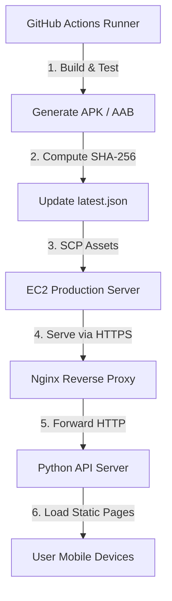

# Vazhi Release Distribution & Download Architecture

This document provides a comprehensive overview of the Vazhi release distribution system, build pipelines, and download verification workflows.

---

## 🏗️ Release Architecture Diagram



---

## 🔄 Release Promotion Workflow

To protect production stability, we enforce a strict **Build → Test → Package → Upload → Promote** chain.

```text
    [Commit Code]
          │
          ▼
    [Lint & Unit Tests] ──(Failed)──► [Block Build]
          │
          ▼
    [Typecheck (TypeScript)] ──(Failed)──► [Block Build]
          │
          ▼
    [Gradle APK Build]
          │
          ▼
    [Compute Checksum]
          │
          ▼
    [Upload to Server / Static files]
          │
          ▼
    [Verify Health Check] ──(Failed)──► [Rollback Deployment]
          │
          ▼
    [Promote to Latest]
```

---

## 📂 Artifact Storage Structure

All releases are versioned and stored in the static file system of the EC2 production instance (with optional S3 synchronization backup enabled):

```text
/home/ubuntu/Vazhi/backend/src/static/
├── download.html        # Landing Portal page
├── android.html         # Android Download Details
├── ios.html             # iOS App Store & TestFlight Guide
├── android_auto.html    # Android Auto Setup Guide
├── releases.html        # Historical Releases table
├── latest.json          # Machine-readable release metadata
├── releases.json        # Dynamic release history list
└── files/               # Binary Packages
    ├── Vazhi-v1.0.0.apk
    └── Vazhi-v1.0.0.aab
```

---

## 🛡️ Distribution Rules & Guidelines

### 1. Android Distribution
- Direct installation via universal debug and release APKs hosted at `/download/files/Vazhi-v{version}.apk`.
- Verification via SHA-256 checksums displayed on the download details page.

### 2. iOS Distribution
- Unsigned IPAs are blocked from direct download.
- Beta versions are distributed exclusively via Apple TestFlight.
- Production releases map directly to the Apple App Store.

### 3. Android Auto Integration
- Android Auto configurations are bundled inside the core Android APK build.
- System requires Android 8.0+ and Google Play services to execute successfully in dashboard consoles.

---

## 🛠️ Operational Procedures

### How to Manually Promote a Release
1. Update `latest.json` with the new version details, file URL, and computed SHA-256 checksum.
2. Update the historical release entries list in `releases.json`.
3. Copy the built APK/AAB to the EC2 server path:
   `scp -i private_key.pem app-release.apk ubuntu@98.84.205.228:/home/ubuntu/Vazhi/backend/src/static/files/Vazhi-vX.Y.Z.apk`

### How to Verify a Release
1. Run local tests: `python backend/src/run_tests.py`
2. Perform remote health check: `curl -f https://vazhi.duckdns.org/health`
3. Verify download status code returns HTTP 200:
   `curl -I https://vazhi.duckdns.org/download/files/Vazhi-v1.0.0.apk`

### How to Recover from a Failed Deployment
1. Connect via SSH to the server.
2. Rollback the Docker containers:
   `docker compose -f backend/docker-compose.prod.yml down`
   `git checkout HEAD~1`
   `docker compose -f backend/docker-compose.prod.yml up -d --build`
