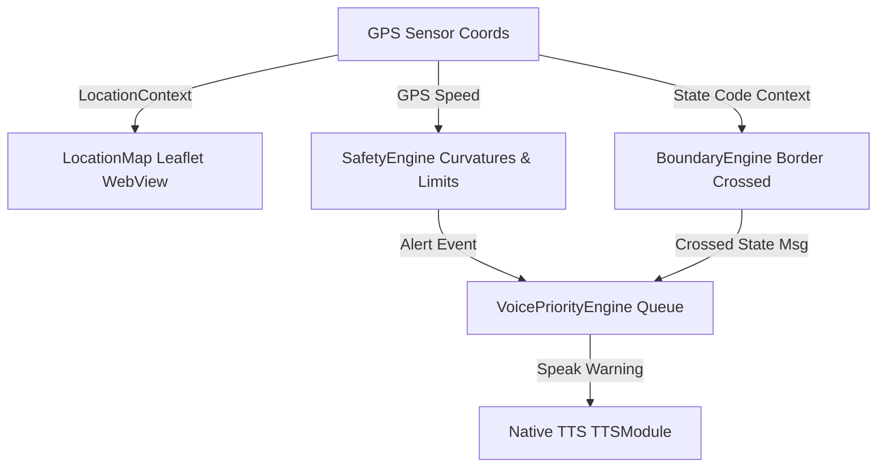

# VAZHI Rebuild — System Architecture

This document describes the core architecture, directories, and data streams of the VAZHI driving co-pilot.

---

## 1. System Structure

```
VAZHI
├── frontend/             # Single React Native Mobile UX
│   ├── android/          # Native Android Project Wrapper
│   └── src/
│       ├── components/   # LocationMap, SpeedLimitDisplay
│       ├── context/      # Theme, Location GPS contexts
│       ├── domain/       # Pure Engine rules (Navigation, Safety, Voice, Geo, Trip)
│       ├── features/     # Screen layout tabs and pages
│       ├── services/     # API Client, ConnectionManager, Offline fallbacks
│       └── store/        # Redux Toolkit global slices
│
├── backend/              # Python FastAPI/http.server API endpoints
│   └── src/
│       ├── database.py   # SQLite compilation rules and queries
│       ├── server.py     # HTTP Request Routing
│       ├── main.py       # Core Query Controller
│       └── static/       # Download web assets and APK targets
│
└── .github/              # Workflow definitions
```

---

## 2. Dynamic Data streams



---

## 3. Standard Contracts
- All backend-to-frontend communications route through `VazhiApiClient` using `POST /query`.
- Screens consume domain logic exclusively through defined domain engines (`NavigationEngine`, `SafetyEngine`, `VoicePriorityEngine`, `BoundaryEngine`, `TripPlannerEngine`).
